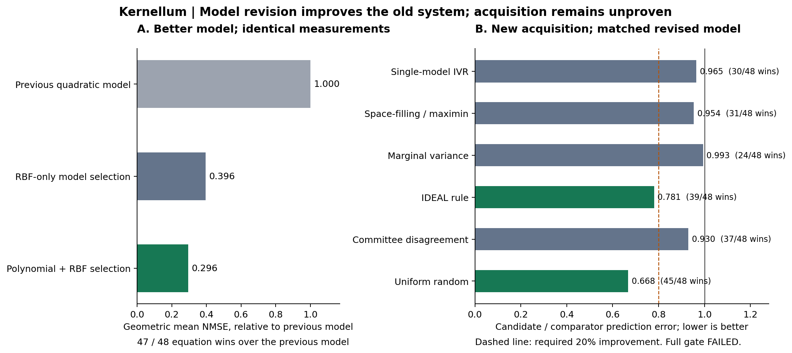

# Model revision: a measured improvement, not a breakthrough

**30 September 2026 · Kernellum Scientific Discovery / Machine Reasoning**

**Result:** revising the predictor reduced aggregate error by **70.44%** against
Kernellum's previous quadratic predictor with **exactly the same measurements**,
winning on **47 of 48** equation rows. The proposed measurement-selection rule
added only **4.64%** improvement over space-filling sampling with the revised
predictor. **Both full prespecified acceptance gates failed. No scientific
breakthrough or state-of-the-art performance is established.**

## What was completed

The previous study identified restricted model capacity as a likely bottleneck.
This study actually changes that model class: an observed-data cross-validation
rule selects among linear, quadratic, cubic and three RBF kernel families, with
three regularization strengths per family. An experimental acquisition rule uses
within-model uncertainty and between-model disagreement to select measurements.
The math components are established methods; the implementation is a candidate
combination, not a claim to have invented model revision or variance reduction.

The protocol and implementation were committed locally as
`16e673d` before generating comparative results. Automatic approval review blocked
the GitHub push, so this was a **local freeze, not a public preregistration**.
The source hashes and run manifest retain the provenance. No method was retuned
on the opened outcomes. The original failed study remains untouched.

All **2,592 trials** completed: 48 published Feynman equations with 4–9 variables,
three fresh random seeds, two noise levels, and nine methods. Every trial spent
64 measurements, including a common 16-point start; total accounted label calls:
**165,888**. Inputs and labels were simulated from published formulas and bounds.
There were no paid API calls, physical measurements, new physical laws, or
symbolic equation-recovery claims.

The 48 rows were excluded from the earlier 52-equation experiment. They are
published and may be algebraically related to previous rows, so this is not a
secret or fully independent benchmark. The selector receives coordinates and
queried responses only; formulas and test labels do not enter acquisition or
model selection.

## Separating model improvement from acquisition improvement

The metric is geometric mean normalized test MSE, with an error floor of 1e-8
inside log ratios. Ratios below 1 favor the candidate. Equations receive equal
weight across their seed/noise trials. These are descriptive results, not
population-wide significance claims.

### Model revision, with identical maximin measurement sequences

| Comparator | Revised / comparator error | Error reduction | Equation wins |
|---|---:|---:|---:|
| Previous quadratic predictor | 0.29560 | 70.44% | 47/48 |
| Cross-validated RBF-only predictor | 0.74586 | 25.41% | 22/48 |

Against the old predictor, the ratio is 0.24209 in the clean condition and 0.36095
with noise. Against RBF-only it is 0.64822 clean and 0.85821 noisy. Thus the
aggregate benefit is not limited to the clean condition.

However, the full model-revision gate required at least 60% equation wins against
**both** controls, in addition to a 20% aggregate reduction and no noise-condition
regression. It **failed** on wins against RBF-only: 22 wins, 9 ties and 17 losses
(ties use a 1e-8 tolerance in the post-hoc diagnostic). We retain that verdict.

### New acquisition, using the same revised final predictor

| Comparator | Mixture IVR / comparator error | Error reduction | Equation wins |
|---|---:|---:|---:|
| Single-model IVR | 0.96488 | 3.51% | 30/48 |
| Space-filling / maximin | 0.95365 | 4.64% | 31/48 |
| Marginal variance | 0.99346 | 0.65% | 24/48 |
| IDEAL acquisition rule | 0.78067 | 21.93% | 39/48 |
| Committee disagreement | 0.92979 | 7.02% | 37/48 |
| Uniform random | 0.66783 | 33.22% | 45/48 |

The complete pipeline has 71.81% lower error than the previous
quadratic-plus-maximin pipeline (ratio 0.28190, 46/48 wins). Most of that is the
model change, not the proposed acquisition rule. Comparing only with random or
the previous restricted model would exaggerate the new acquisition's value.

The acquisition gate demanded >=20% improvement against **every** specified
control, >=60% equation wins against every control, and no noise-condition
regression. It **failed**, despite some favorable comparisons.

IDEAL here means its published acquisition equations under shared model,
initialization and batch-refresh settings. This does not reproduce every setting
of the author's complete benchmark. R-IDeA and EMCM are not implemented; no
superiority to the current research frontier follows.



## Failure analysis and next research decision

These diagnostics were made after opening the outcomes and do not modify gates:

- The median equation ratio against RBF-only is **1.0**.
- Removing the two largest model-revision gains after the fact changes the RBF
  comparison from 25.41% lower aggregate error to **6.05%** lower. This is a
  sensitivity check, not a replacement endpoint.
- The worst equation-level model-revision regression against RBF-only is **15.63%**
  (`I.43.43`). Other regressions include `II.11.27` (12.99%) and `I.38.12` (10.69%).
- At the final checkpoint under maximin, the selected families were cubic in
  106/288 trials, long RBF in 102, medium RBF in 49, quadratic in 17, short RBF in
  10 and linear in 4. More flexibility does not automatically imply better
  generalization from these small adaptive samples.

**Decision:** keep the candidate as a research option. Do not promote mixture IVR
as the default or describe it as a breakthrough. The next justified hypothesis is
whether model selection can preserve the large gains on simple functions without
its regressions on others, under a fresh external cohort and stronger baselines.
That hypothesis is not confirmed here. Do not keep tuning acquisition weights
against these now-opened 48 equations.

## Verification

The separate audit imports neither the Kernellum implementation nor the experiment
runner. It rebuilds sampled data, solves augmented intercept systems, checks the
entire trial grid, verifies all queried values and equal budgets, confirms cohort
disjointness by row, and reconstructs all **7,776 checkpoint errors**. The maximum
absolute NMSE difference was **2.2244e-8**, with **zero model-choice disagreements**.
It recomputed both failed gate verdicts. This is a second implementation by the
same author, not independent external scientific reproduction.

Eight new tests compare LOO errors with explicit leave-one-out refits, IVR with
explicit covariance trace reductions, posterior covariance with an alternative
block-system solve, and IDEAL scores with scalar equations. They also check
positive semidefiniteness, affine-label behavior, observation validity, and
measurement accounting. Full repository suite: **130 tests and 11 subtests passed**.
The initial broad test attempt lacked pytest; it was installed and the full suite
then passed. No failing test was removed.

Run time was 92.99 seconds for simulated trials and 25.18 seconds for the arithmetic
audit in this environment. These numbers do not estimate laboratory time or
physical-experiment savings.

## Reproduce and inspect

From the repository root, or the extracted reproducibility package:

```bash
OPENBLAS_NUM_THREADS=1 OMP_NUM_THREADS=1 PYTHONPATH=. python -m unittest tests.test_model_revision -v
OPENBLAS_NUM_THREADS=1 OMP_NUM_THREADS=1 PYTHONPATH=. python experiments/model_revision/run.py --out build/model-revision
OPENBLAS_NUM_THREADS=1 OMP_NUM_THREADS=1 PYTHONPATH=. python scripts/audit_model_revision.py --folder results/model_revision/frozen_run --out build/model-revision-audit.json
```

The runner refuses to overwrite an existing output directory. The portable
package includes a bootstrap script to initialize a local source snapshot before
reproduction. That newly created snapshot is not the original freeze timestamp.

Evidence:

- `docs/MODEL_REVISION_PROTOCOL.md`: frozen protocol and prior-art links.
- `results/model_revision/frozen_run/summary.json`: all equation/noise ratios.
- `results/model_revision/frozen_run/traces.jsonl.gz`: every query and model choice.
- `results/model_revision/frozen_run/manifest.json`: exact source/output hashes.
- `results/model_revision/audit.json`: separate implementation audit.
- `results/model_revision/diagnostics.json`: explicit post-hoc sensitivity checks.
- `experiments/model_revision/report.py`: reproducible figures and diagnostics.

A new field-level contribution remains unachieved. A reproducible improvement
over Kernellum's previous predictive component has been obtained, with its stronger
baseline failures exposed rather than hidden.
